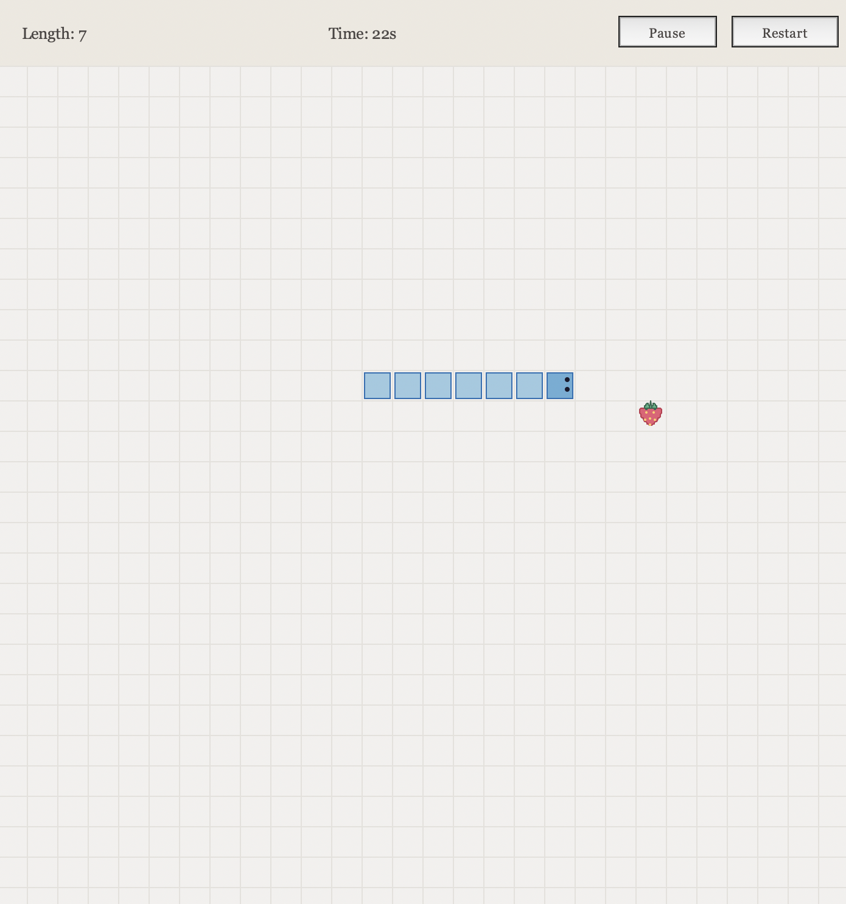
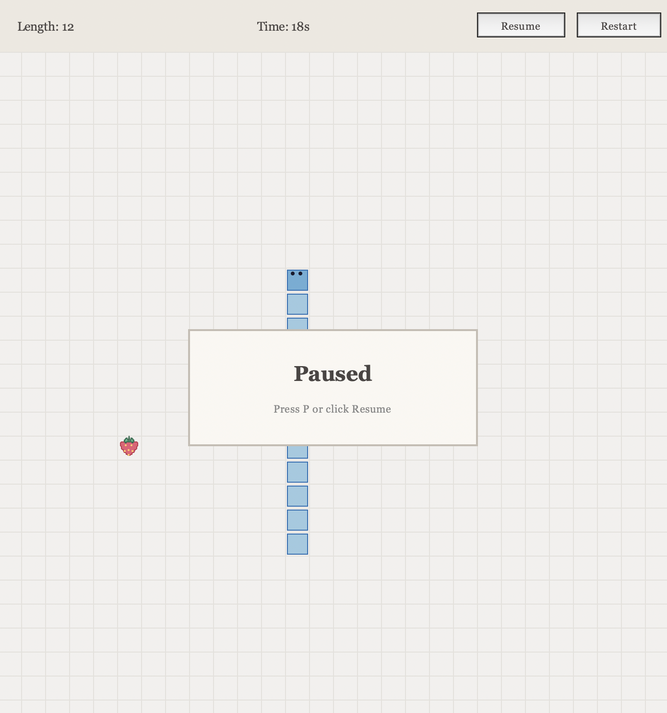
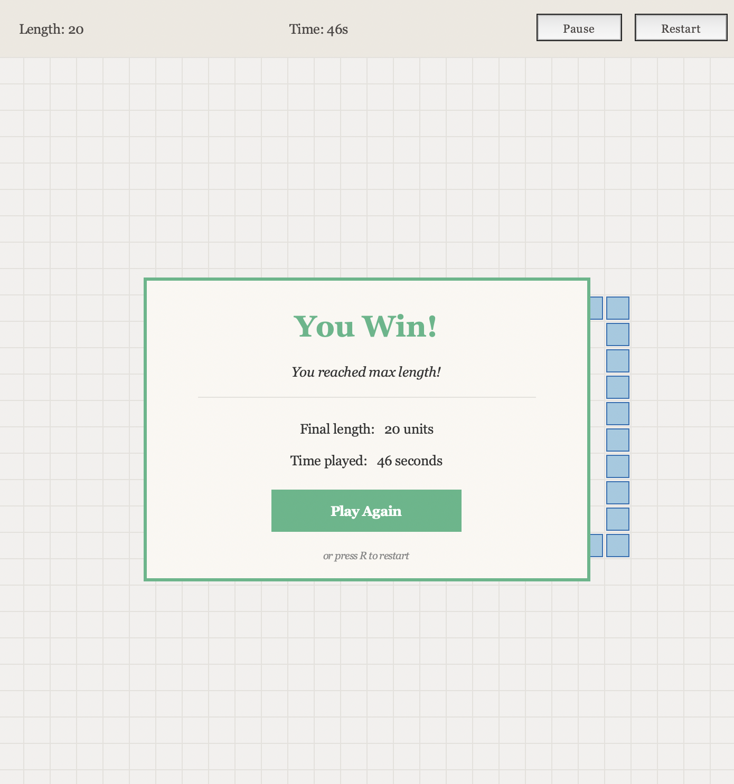

# Python Snake Game

This project recreates the classic Snake game using Python and the Tkinter GUI library.

## Features

- Snake movement using arrow keys
- Two food types with different growth effects
- Pause and resume (P key or button)
- Restart (R key or button)
- Timer and snake length display
- Win and game over screens

## Game Rules

Control the snake to collect food, grow longer, and reach the target length while avoiding collisions.

- Use the arrow keys to control the snake.
- Avoid hitting the walls or the snake's own body, or the game will end.
- Blueberries increase the snake's length by 1, while strawberries increase it by 2.
- Reach a length of 20 to win the game.

## Screenshots

| Gameplay | Pause | Win |
|----------|----------|----------|
|  |  |  |
